# 橙线插画 · Orange Line Illustration

**中文** | [English](README.en.md)

上周写了一篇文章，与 AI 一起做产品的六条原则，很多朋友都喜欢这套插图，问我怎么做，就把它做成 skill，开源发布。

周六的时候，去出海去的活动做了一次分享，分享的 PPT 也是这套插图做的，也有很多朋友喜欢。

在 AI 信息图和 HTML 文字块泛滥的今天，也许一张有空白的插画反而能让注意力聚焦在一点。据说 PPT 做到极致，每页就只有一句话。

于是周末这两天在家，都在持续迭代这个插图，目标是让它变得更稳定、更好看、更有趣。

我想要的效果是，让人一眼就懂，会心一笑。

支持两种工作流：
- **单张插图** — 为文章、原则、封面生成概念配图
- **PPT 演讲稿** — 将文章/大纲变成带插图的 HTML 幻灯片

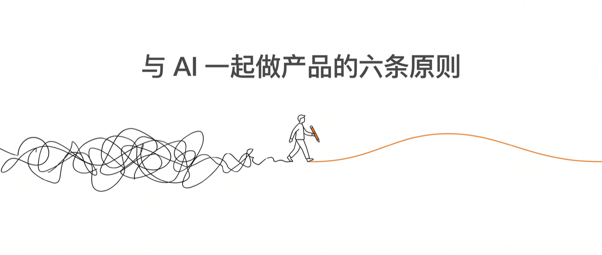

---

## Demo：《置身钉内》20 个切片

用这套 skill 为 7.5 万字的阿里内网长文《置身钉内》生成了 20 张插图，每张配一句原文金句。完整效果：

👉 [**公众号文章：置身钉内的 20 个切片**](https://mp.weixin.qq.com/s/GHZvaKlrHFIC71VMlmKl6A)

以下是其中部分示例：

| | |
|---|---|
| 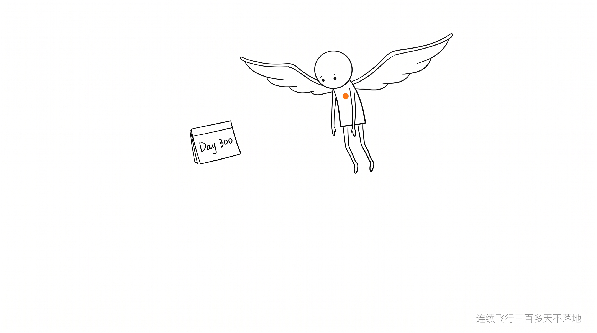 | 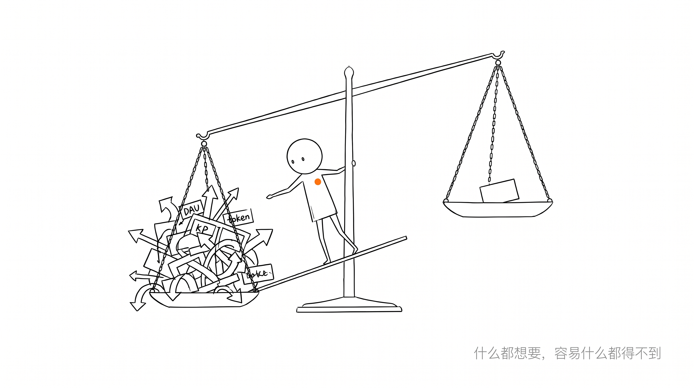 |
| "连续飞行三百多天不落地" | "什么都想要，容易什么都得不到" |
|  |  |
| "永远站在发信人立场" | "旗帜能聚拢人，也容易把太多东西挂上去" |
| 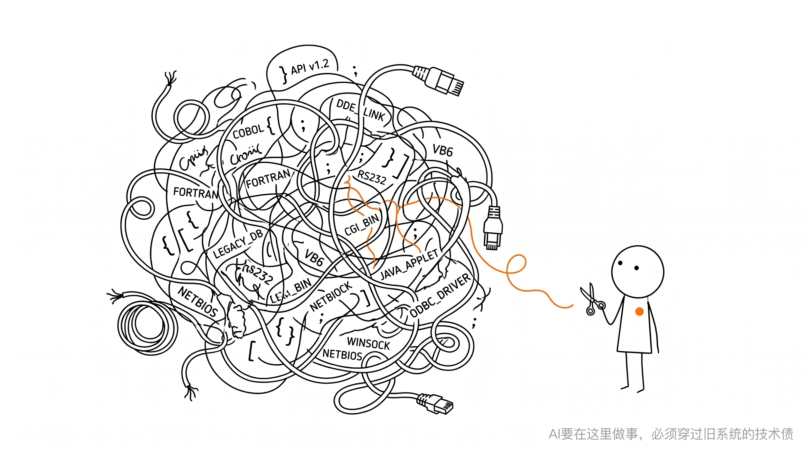 | 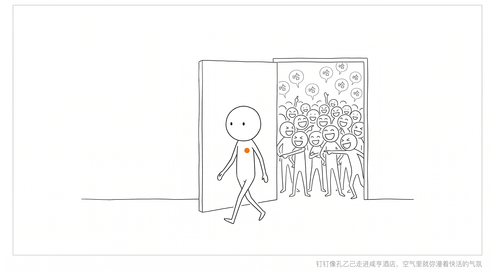 |
| "AI必须穿过旧系统的技术债" | "钉钉像孔乙己走进咸亨酒店" |
|  | 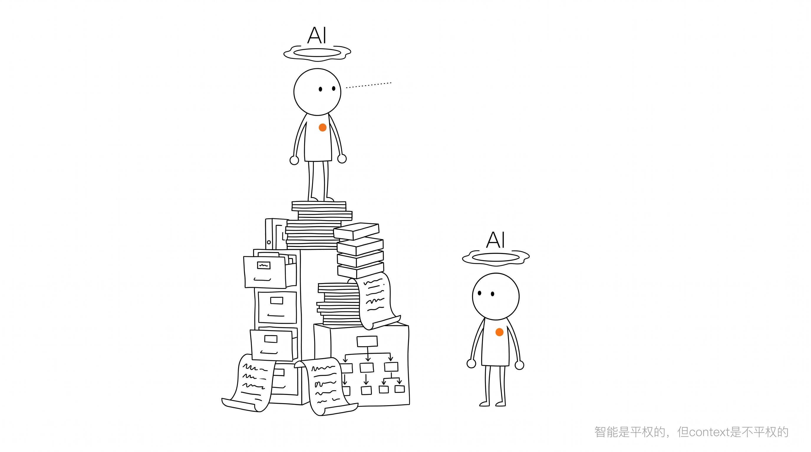 |
| "凡历术在于常数，而不在于变行" | "智能是平权的，但context是不平权的" |
| 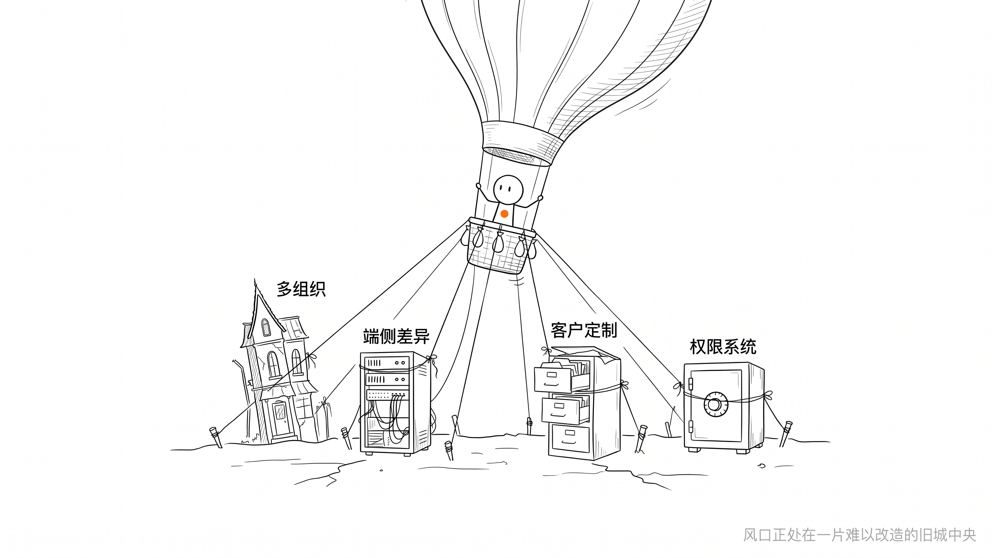 | 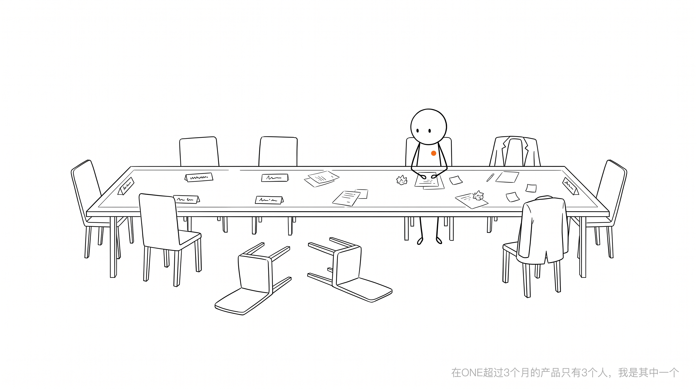 |
| "风口正处在一片旧城中央" | "在ONE超过3个月的产品只有3个人" |

---

## 风格示例（通用）

| | |
|---|---|
| 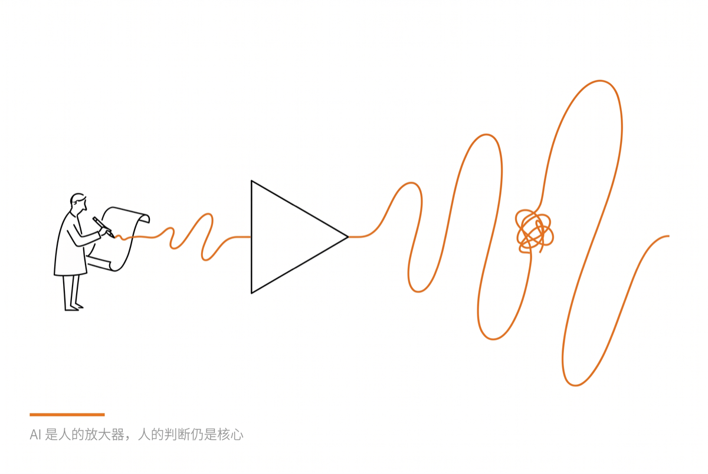 |  |

注意尺度：人永远**极小**，物永远宏大。这种失衡感正是这个风格的签名式戏剧性。

---

## 角色 IP 系统

三个可复用角色 IP，每个有固定形态定义。不是装饰，必须承担核心动作。

### 小橙（默认角色）

纯黑线条勾勒的几何小人，胸口一个橙色圆点。安静做事，不声张。

- 圆形头部（轮廓不填色）+ 两个黑点眼 + 无嘴
- 窄长方形身体轮廓 + 细线四肢
- 胸口唯一的橙色圆点 `#F97316` = 整张图的点缀色

| | |
|---|---|
| 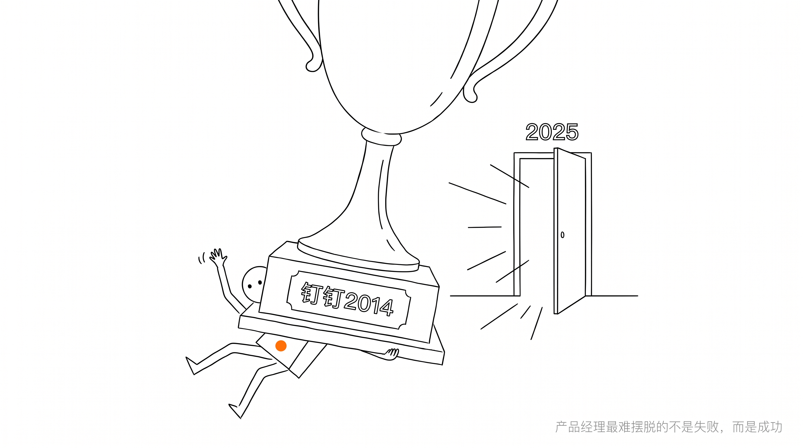 |  |
| "产品经理最难摆脱的不是失败，而是成功" | "面对几十个群里炸开的海量未读消息" |

### 线人

极简抽象人形——圆形头部 + 一根弧线身体 + 单线四肢。最少的笔画构成"有人在这里"。

| 旧城风口 |
|---|
|  |

> 「站在一个很有吸引力的风口，但风口正处在一片旧城中央」

### 线猫

10-12 笔画完的幼猫符号——不闭合的弧线、两个黑点眼、两撇耳朵。观者的大脑自动补全。

| 薛定谔的用户 |
|---|
| 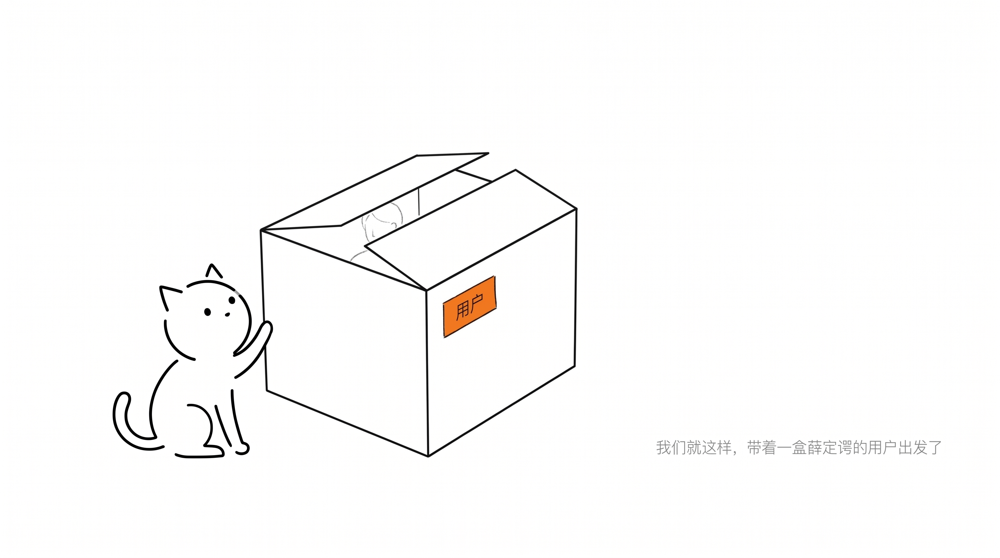 |

> 「我们就这样，带着一盒薛定谔的用户出发了」

---

## 风格规范（快速一览）

- **线条**：细黑墨线，手绘微抖，不机械
- **背景**：纯白，不要纸纹、渐变、阴影
- **点缀色**：唯一暖橙 `#F97316`，落在最有意义的那个元素上
- **人物**：极小。物永远宏大，人永远渺小
- **金句标注**：右下角灰色小字，安静、可读、不喧宾夺主
- **气质**：witty, restrained, intelligent

详见 `SKILL.md` 和 `references/` 目录下的完整规范。

---

## 两种工作流

### 工作流 A：单张概念插图

为文章中的某个判断、原则、隐喻生成一张 16:9 配图。

```
给这篇文章配三张橙线风格插图
```

流程：提炼金句 → 设计具体场景 → 生成候选 → 人来挑选

### 工作流 B：PPT 演讲稿

将文章/大纲变成带插图的 HTML 幻灯片，每页一张场景插画。

```
把这篇文章做成橙线 PPT
```

流程：读文章 → 写幻灯片大纲 → 确认 → 批量生成插图 → 用户选图 → 输出 HTML

详见 `references/ppt-workflow.md`。

---

## 目录结构

```
.
├── SKILL.md                          # 主规范：风格、隐喻方法、prompt 模板
├── references/
│   ├── xiao-orange-ip.md             # 小橙 IP 定义
│   ├── xiao-orange-prompt-template.md # 小橙生图模板
│   ├── xianren-ip.md                 # 线人 IP 定义
│   ├── xianmao-ip.md                 # 线猫 IP 定义
│   └── ppt-workflow.md               # PPT 演讲稿工作流
├── examples/                         # 示例图片
├── LICENSE.md
└── README.md
```

## 安装

适用于任何支持 SKILL.md 约定的 AI agent（Cola、Claude Code、Codex 等）。把目录放进你的 agent 的 skill 文件夹即可：

```bash
# Cola
~/.cola/skills/orange-line-illustration/

# Claude Code
~/.claude/skills/orange-line-illustration/
```

然后直接对你的 agent 说——"给这篇文章配三张橙线风格插图"或"把这篇文章做成橙线 PPT"——它就会照着规范来。

## 协议

**双许可**：开源与个人使用免费；闭源/专有用途需购买商业授权。详见 [LICENSE.md](LICENSE.md)。
